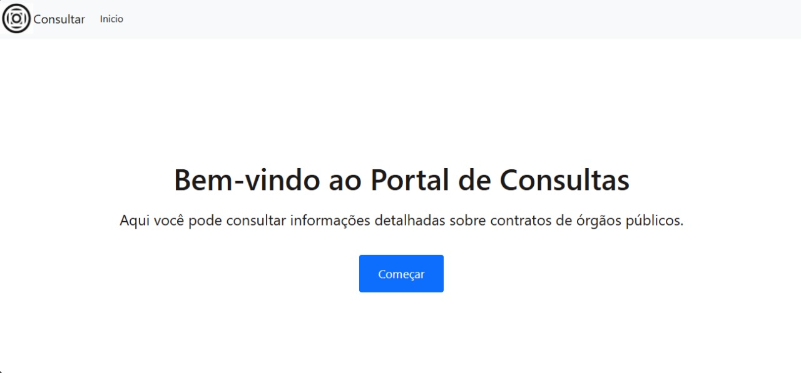
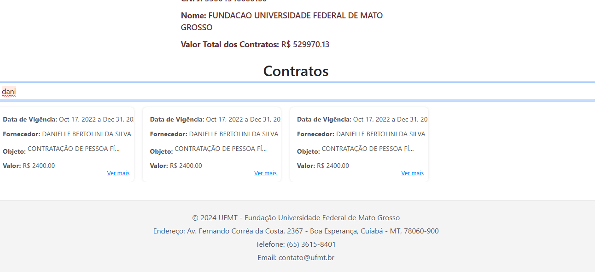

## Projeto Teste Prático - Nuti

Este projeto foi desenvolvido como parte do teste prático para a Nuti, seguindo todas as especificações fornecidas. O objetivo principal é criar uma aplicação que realiza consultas de contratos baseados em intervalos de datas e filtra as informações por CNPJ de órgão público.
## Funcionalidades do Projeto

### API de Contratos por Intervalo de Datas e CNPJ:

  - A aplicação realiza consultas a uma API externa, buscando contratos em um intervalo de datas fornecido e filtrando as informações com base no CNPJ de um órgão público.
### Verificação de Informações no Banco de Dados: 
- Antes de realizar a requisição à API externa, o sistema verifica se os dados já existem no banco de dados local, otimizando o tempo de resposta e evitando consultas desnecessárias.

### Formatação de Dados:
- Os dados retornados pela API são processados e formatados para melhor exibição e análise, garantindo que estejam organizados e de fácil entendimento.

### Busca por Contratante:
- A aplicação permite realizar buscas nos resultados da pesquisa filtrando por contratante, facilitando a localização de informações específicas dentro dos resultados obtidos.

## Ferramentas

## Screenshots

### tela inicial

### Seção - pesquisa
- Seção dedicica fornecer dados para busca de contratos
  

### Seção - resultado da pesquisa
- Cards com scroll horizontal
  

### Seção - Modal: ver mais
- Contratos com muitas merece uma atenção especial, entao foi decidido que seria melhor criar um modal para visualizção completa dos dados.
  

### Seção - procurar nos resultados da pesquisa
- Dentro da pesquisa podemos querer ver um contrato em especifico, entao essa função criada para facilidade a usabilidade do site.
  

## Sobre o autor

<!-- Coloque seu nome, uma foto sua e uma pequena bio sobre você na seguinte tabela: -->
|  |  |
|:-------------:|:------------------------------------------------------------:|
|    **Alan Bruno Morais Costa** | 
Me chamo Alan, sou estudante de Ciências da Computação na Universidade Federal de Mato Grosso (UFMT). Este repositório contém o projeto prático para o teste da Nuti. A Nuti é um projeto prático que funciona como consultor de contratos públicos, realizando consultas de contratos por intervalo de datas e CNPJ, além de otimizar a organização e busca por contratantes.  |

- **Email:** alanbrunomoraescosta18@hotmail.com
- **LinkedIn:** [Alan  LinkedIn](https://www.linkedin.com/in/alan-morais-4861322b0)
